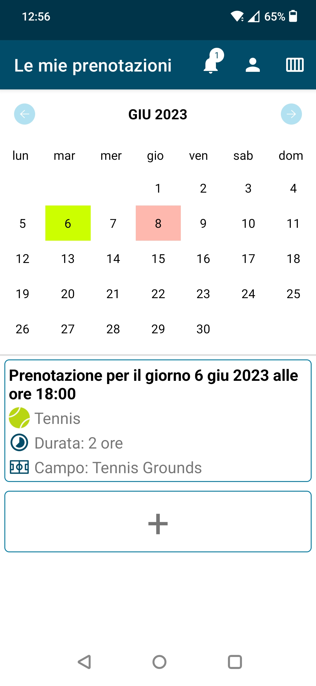

# Mobile Application Development Labs
### Repository per i laboratori del corsi di Mobile Applucation Development
Il repository contiene i 5 laboratori e il progetto finale per il corso di Mobile Application Development (A. A. 2022/23, Politecnico di Torino). Ogni cartella contiene il PDF della consegna.

[🌐 Here in English](README.md)

## Lab 1: exercizi Kotlin da Exercism

4 esercizi dalla track Kotlin di Exercism: Bank account, Forth, List-Ops e Minesweeper

## Lab 2-5 e progetto finale: Playgrounds Reservations

I laboratori successivi e il progetto finale avevano lo scopo di creare un'applicazione per la prenotazione di campi disponibili per giocare una selezione di sport.

Il progetto e l'app sono puramente dimostrativi: lo scopo principale era quello di testare e, appunto, dimostrare tutte le diverse tecnologie che possono essere utilizzate per sviluppare un applicazione Android. Per questa specifica ragione l'app è un misto tra activity e fragment, schermate view-based e Jetpack Compose.

Inoltre, non sono state operate ottimizzazioni, soprattutto a causa di limiti di tempo: principalmente, l'intera app opera dal thread principale e salta frame di frequente.

### Feature

- Esplora la disponibilità dei campi, anche senza eseguire il login
- Accedi o iscriviti con email e password o con un account Google
- Visualizza le prenotazioni già effettuate attraverso un calendario
- Inserisci una nuova prenotazione, selezionando un campo dai recenti o dai preferiti o cercandone uno per mezzo di filtri
- Modifica o cancella una prenotazione esistente
- Invita amici ad una prenotazione, selezionandoli dagli utenti recenti o preferiti o cercandone uno
- Ricevi notifiche in-app per inviti a prenotazioni ricevuti
- Revoca la partecipazione per un invito ad una prenotazione accettato
- Personalizza il tuo profilo con informazioni personali da mostrare ad amici e utenti dell'app

### Feature orizzontali

- L'app supporta la localizzazione multilingue ed è completamemte tradotta in inglese ed italiano
- L'app supporta sia l'orientamento verticale sia quello orizzontale ed è sufficientemente diversificata per le due alternative

### Tecnologie usate

- L'app è completamente sviluppata in Kotlin
- Activity e fragment view-based
- Fragment Jetpack Compose (per integrarsi con il grafo di navigazione usato per i fragment)
- Database Firebase Firestore
- Autenticazione con Firebase UI
- Archiviazione Firebase per salvare le immagini del profilo
- Database Room locale per i laboratori 3 e 4

### Limitazioni e bug noti
- L'app supporta anche il tema scuro, ma lo schema dei colori non è stato valutato o testato con accortezza
- Accettare un invito mentre l'utente che lo ha inviato lo revoca
- Due utenti che inseriscono una prenotazione allo stesso tempo
- In generale, la concorrenza non è stata gestita
- Come menzionato in precedenza, sarebbero necessarie molte ottimizzazioni per migliorare le prestazioni

### Screenshot

|  Calendario |  Disponibilità dei campi |  Aggiungi prenotazione |
| :-------------: | :-------------: | :-------------: |
|  **Scegli campo** |  **Mostra prenotazione** |  **Schermata delle notifiche** |
|  **Mostra profilo** | | |

### Contenuto delle cartelle e breve changelog
- Laboratorio 2
	- Mostra e modifica il proprio profilo

- Laboratorio 3 
	- Mostra le proprie prenotazioni
	- Esplora la disponibilità dei campi
	- Aggiungi, modifica o cancella una prenotazione
	- Introdotto il database Room locale

- Laboratorio 4
	- Valuta un campo prenotato in precedenza

- Laboratorio 5
	- Mostra le valutazioni passate per uno specifico campo
	- Sostituito il database con Firebase Firestore
	- Login (interazioni multiutente gestite in maniera appropriata)
	- Schermate di caricamento

- Progetto finale
	- Invita amici ad una prenotazione
	- Gestisci gli inviti ricevuti dalle notifiche
	- Aggiungi amici e campi ai preferiti
	- Bug fix generale e gestione dei casi limite

---

Ci scusiamo se qualunque delle tecnologie, plugin o componenti usati richiedeva un riconoscimento che non è stato fornito: si sottolinea che l'app non è mai stata pensata per essere resa pubblica od operativa.